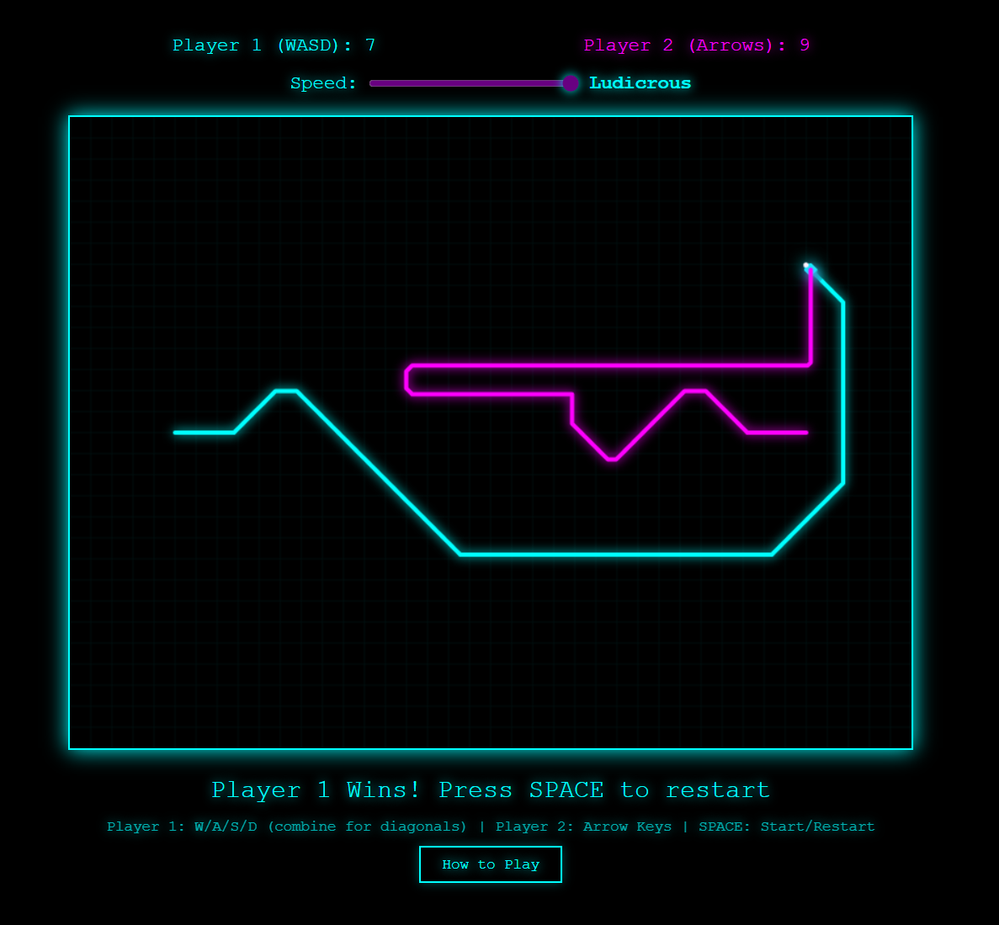

# 🏍️ Tron Lightcycles: Diagonal Edition

A modern take on the classic Tron Lightcycles arcade game with a revolutionary twist - **8-directional diagonal movement**! Built with pure HTML5, CSS3, and JavaScript with Web Audio API for immersive sound effects.



## 🎮 Play Now

[**Play the game here!**](https://nwfella.github.io/tron-lightcycles/)

Simply open `index.html` in any modern web browser to start playing!

## ✨ Features

- **Diagonal Movement**: Move in 8 directions instead of the classic 4 by combining keys
- **2-Player Local Multiplayer**: Challenge a friend on the same keyboard
- **Dynamic Audio**: 
  - Continuous lightcycle engine sounds with modulation
  - Rev sound effects on direction changes
  - Explosive collision sound effects
- **Adjustable Speed**: Choose from Slow, Normal, Fast, or Ludicrous speed settings
- **Particle Effects**: Spectacular explosion animations on collision
- **Retro Aesthetic**: Neon glowing trails and Tron-inspired visual design
- **Top-Down Lightcycle Icons**: Animated bikes with streaming light trails
- **Score Tracking**: Persistent scores across rounds
- **Head-On Collision Bonus**: Both players score when they collide head-on!

## 🕹️ Controls

### Player 1 (Cyan)
- **W** - Move North
- **S** - Move South
- **A** - Move West
- **D** - Move East
- **Combine keys** for diagonals (e.g., W+D for Northeast)

### Player 2 (Magenta)
- **↑** - Move North
- **↓** - Move South
- **←** - Move West
- **→** - Move East
- **Combine arrows** for diagonals (e.g., ↑+→ for Northeast)

### Game Controls
- **SPACE** - Start/Restart game
- **Speed Slider** - Adjust game speed in real-time
- **How to Play** - Click button for detailed instructions

## 🎯 How to Play

1. Each player controls a lightcycle that leaves a deadly light trail
2. Avoid crashing into:
   - Your own trail
   - Your opponent's trail
   - The arena walls
3. Use diagonal movement to:
   - Cut corners and make tighter turns
   - Create complex trail patterns
   - Trap your opponent
4. Last cycle standing wins the round!
5. Head-on collisions award both players a point

## 🚀 Installation & Setup

### Quick Start
1. Download or clone this repository:
   ```bash
   git clone https://github.com/yourusername/tron-lightcycles.git
   cd tron-lightcycles
   ```

2. Open `index.html` in your web browser

That's it! No build process or dependencies required.

### Deploy to GitHub Pages

1. Go to your repository settings on GitHub
2. Navigate to "Pages" in the left sidebar
3. Under "Source", select the branch (usually `main`) and folder (`root`)
4. Click "Save"
5. Your game will be live at `https://yourusername.github.io/tron-lightcycles`

## 📁 Project Structure

```
tron-lightcycles/
├── index.html          # Main game file (complete standalone)
├── README.md           # This file
├── LICENSE             # MIT License
└── screenshot.png      # Game screenshot (optional)
```

## 🛠️ Technical Details

- **Pure Vanilla JavaScript** - No frameworks or libraries
- **HTML5 Canvas API** - For rendering graphics
- **Web Audio API** - For procedural sound generation
- **CSS3** - For UI styling with neon glow effects
- **Responsive Design** - Fixed canvas size optimized for gameplay

### Browser Compatibility
- Chrome/Edge 90+
- Firefox 88+
- Safari 14+
- Any modern browser with ES6 support

## 🎨 Customization

You can easily customize the game by modifying these variables in `index.html`:

```javascript
const GRID_SIZE = 4;        // Trail thickness
let SPEED = 100;            // Default game speed (lower = faster)
const EXPLOSION_DURATION = 800;  // Explosion animation length

// Player colors
players.p1.color = '#0ff';  // Cyan
players.p2.color = '#f0f';  // Magenta
```

## 🤝 Contributing

Contributions are welcome! Feel free to:
- Report bugs
- Suggest new features
- Submit pull requests
- Improve documentation

## 📝 License

This project is licensed under the MIT License - see the [LICENSE](LICENSE) file for details.

## 🙏 Acknowledgments

- Inspired by the classic Tron arcade game (1982)
- Built as a modern HTML5 tribute to retro gaming
- Sound effects generated using Web Audio API

## 🐛 Known Issues

- Audio may not start on first load in some browsers (click anywhere to enable)
- Best played on desktop with physical keyboard

## 📧 Contact

Have questions or suggestions? Feel free to open an issue or reach out!

---

**Fight for the Users!** 🎮✨
